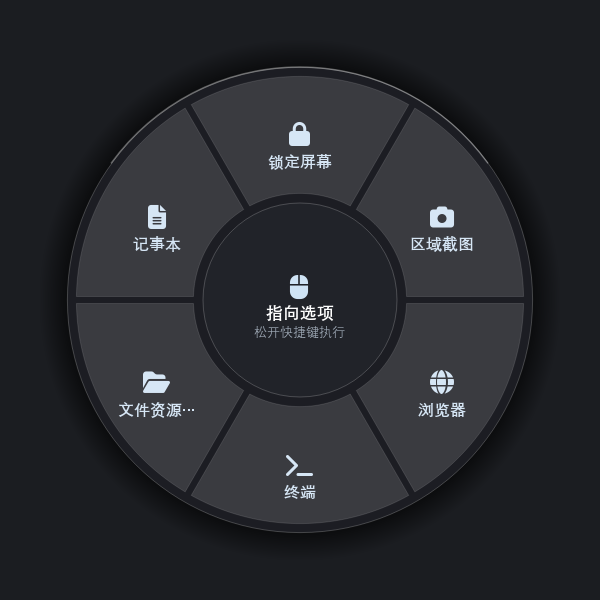
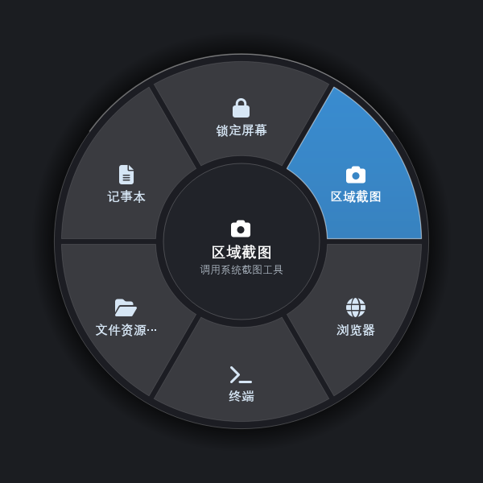
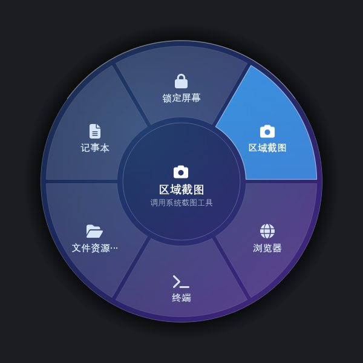
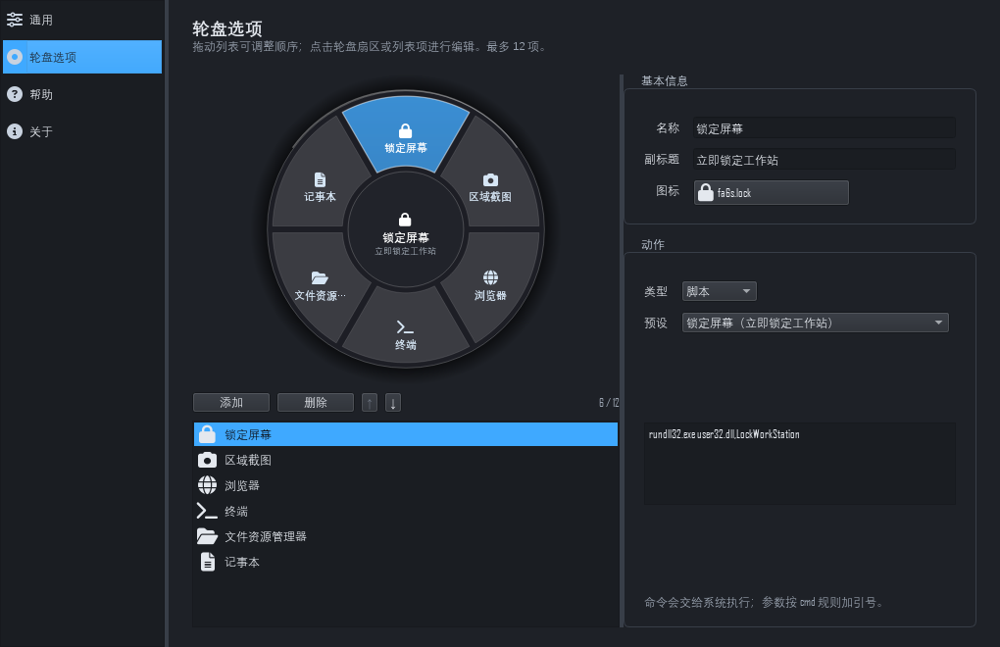
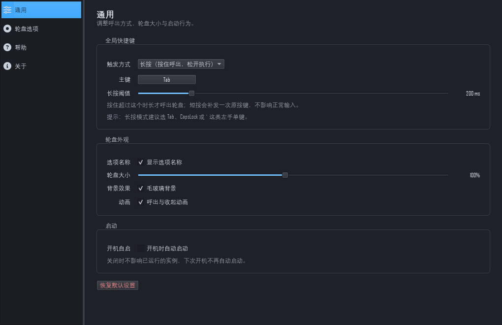

# 妙启轮盘 Windows 版（MiaoQiWheel for Windows）

把 macOS 上的「妙启轮盘」轮盘启动器复刻到 Windows：**按住一个键呼出轮盘 → 移动鼠标选择 → 松开执行**。
纯本地运行、不联网、不上传任何数据，常驻内存约 45~60 MB。

技术栈：Python 3.13 + PySide6（Qt 6）+ Win32 API（ctypes）。

## 界面预览

| 轮盘 | 选中项 | 毛玻璃背景 |
|---|---|---|
|  |  |  |

| 呼出并命中 | 轮盘选项 | 通用设置 |
|---|---|---|
|  |  |  |

> 上面这几张都由 `tools/` 下的自检脚本离屏渲染产出（`smoke_wheel.py`、`smoke_m2.py`、
> `shot_glass.py`、`smoke_m4.py`），不是手工截屏，所以改动界面后重跑脚本即可更新。
>
> ⚠ 毛玻璃配图用的是 `website/assets/img/m5-glass.png`（`tools/shot_glass.py --gradient`
> 产出）。**不要改用 `docs/m5-glass.png`** —— 那个文件是 `tools/smoke_m5.py` 的像素断言
> 夹具，底图是现生成的洋红条纹测试图案，长得像个莫名其妙的紫色轮盘。

---

## 一、快速开始

### 运行（开发模式）

```bat
scripts\setup.bat   :: 首次：创建 venv 并安装依赖
scripts\run.bat     :: 启动（托盘图标出现即成功）
```

### 打包（便携版）

```bat
scripts\build.bat   :: 产出 dist\MiaoQiWheel\ 与 dist\MiaoQiWheel-vX.Y.Z-portable.zip
```

解压 zip 到任意位置，双击 `MiaoQiWheel\MiaoQiWheel.exe` 即可，**无需安装**。
注意：必须整目录解压，单独拷贝 exe 无法运行。

### 打包（安装程序）

```bat
scripts\build_installer.bat   :: 产出 dist\MiaoQiWheel-Setup-X.Y.Z.exe（单文件安装包）
```

需要先跑过 `scripts\build.bat`，并安装 [Inno Setup 6](https://jrsoftware.org/isdl.php)（免费，建议 6.3 以上）。
脚本会自动搜索 `ISCC.exe`；也可显式指定，**填 exe 或安装目录都行**：

```bat
scripts\build_installer.bat --iscc "D:\Program Files (x86)\Inno Setup 6"
```

简体中文界面用的是社区翻译（简体中文不在 Inno Setup 自带语言之列），
已随项目放在 `installer\languages\ChineseSimplified.isl`，无需额外安装语言包。

安装程序行为：默认装到用户目录（免管理员）、可选桌面快捷方式、装完可直接启动、
卸载时询问是否保留 `%APPDATA%\MiaoQiWheel\` 里的个人设置。

> 为什么用安装包而不是单文件 exe：PyInstaller 的 onefile 模式每次启动都要把
> 60+ MB 的 PySide6 解压到 `%TEMP%`，冷启动从 1~2 秒涨到 3~8 秒，对"按住即呼出"
> 的常驻工具影响明显，且更易触发杀软误报。安装包底层仍是 onedir，只是套了层壳。

---

## 二、默认操作

| 操作 | 结果 |
|---|---|
| **长按 Tab ≈0.2 秒** | 呼出轮盘 |
| 移动鼠标 | 高亮跟随扇区 |
| **松开 Tab** | 执行选中项 |
| 短按 Tab（<200ms） | 正常跳格（自动补发一次原生 Tab） |
| 停在盘面正中 / 按 Esc | 取消，不执行 |
| 托盘右键 | 打开设置 / 显示轮盘（测试）/ 退出 |

> 为什么是长按而不是点按：单独 Tab 若做成"点按即呼出"，Tab 就无法再用于表单跳格和 IDE 缩进。
> 阈值在设置里可调（150~400ms，调到 150ms 几乎无感）。也提供双击、组合键两种触发方式。

默认六个选项：锁定屏幕、区域截图、Microsoft Edge、终端、文件资源管理器、记事本。
预设库另有 23 个系统动作（关机/重启/休眠/音量/深色模式/剪贴板等）。

### 浏览器不会越开越多

选「浏览器」时，Edge 已经开着就不再新开窗口：

| 当前状态 | 结果 |
|---|---|
| 没打开 | 新建窗口 |
| 在后台（有窗口但不在前台） | 还原并**最大化**，拉到最前 |
| 已经在前台 | **最小化** |

多窗口并存时，「收起 → 再按一次」还原的是刚才收起的那个，不会跳到另一个窗口上。

终端这类要保留「每次新建」语义的动作**不受影响**——这个行为按动作单独设置，
对应动作类型里的「窗口切换」。想套到别的应用上（VS Code、微信…），
在设置里把该选项的类型改成「窗口切换」即可。

---

## 三、设置项

托盘右键 →「打开设置…」

- **通用**：触发方式（长按 / 双击 / 修饰键组合）、主键录入、长按与双击阈值、显示选项名称、轮盘大小（82%~120%）、毛玻璃背景、呼出与收起动画、开机自启、恢复默认设置
- **轮盘选项**：左侧轮盘实时预览 + 列表（拖拽排序、**从资源管理器拖入 exe/lnk 直接加项**、增删、上下移，2~12 项）；右侧编辑器可改名称/副标题/图标/动作类型/预设与参数。动作类型有六种：应用、窗口切换（见上）、链接、快捷操作、脚本、内置操作
- **帮助**：使用说明与故障排查
- **关于**：版本、致谢、配置目录（可一键打开）

改动即时生效并写入 `%APPDATA%\MiaoQiWheel\settings.json`（原子写入，崩溃不会损坏配置）。

---

## 四、目录结构

```
MiaoQiWheel-Windows/
├── src/mqwheel/
│   ├── main.py                 入口：单实例 + 托盘 + 接线
│   ├── app_identity.py         名称/路径/互斥量常量
│   ├── models/                 纯数据：动作、预设、几何、布局、设置
│   ├── services/               hotkey / action_executor / builtin_actions / window_control /
│   │                           backdrop / app_icons / autostart / symbol_icons …
│   ├── controllers/            overlay_controller（呼出、命中、执行）
│   └── views/                  overlay（轮盘绘制）/ 设置窗口四页 / 通用控件
├── tests/                      pytest 单元测试（140 项）
├── tools/                      smoke_*.py 渲染自检、图标生成、打包辅助
├── scripts/                    setup / run / build 批处理
└── docs/                       各阶段渲染截图与自测清单
```

---

## 五、开发

```bat
.venv\Scripts\python.exe -m pytest          :: 全部单元测试
.venv\Scripts\python.exe tools\smoke_wheel.py   :: 轮盘渲染（M1）
.venv\Scripts\python.exe tools\smoke_m5.py      :: 毛玻璃/纯色/入场三态（M5）
.venv\Scripts\python.exe tools\hotkey_probe.py selftest   :: 热键端到端自检
.venv\Scripts\python.exe tools\smoke_m3.py      :: 23 个预设图标有效性
```

调试开关（环境变量）：

| 变量 | 作用 |
|---|---|
| `MQWHEEL_DISABLE_BACKDROP=1` | 关闭毛玻璃抓屏，降为纯色 |
| `MQWHEEL_LIGHT_THEME=1` | 使用浅色界面 |

---

## 六、与 macOS 版的关键差异

| 项 | macOS | Windows 版做法 |
|---|---|---|
| 热键按下/松开 | Carbon 双事件 | `WH_KEYBOARD_LL` 低级钩子 + 自建状态机（Windows 的 `RegisterHotKey` 只有按下） |
| 悬浮窗不抢焦点 | `NSPanel` | `Qt.Tool` + `WA_ShowWithoutActivating` + `WA_TransparentForMouseEvents` |
| 扇区绘制 | `UIBezierPath` | 采样多边形（Qt 角度语义与 Swift 相反，直接移植必错） |
| 图标 | SF Symbols | FontAwesome 6（qtawesome），系统 Segoe MDL2 兜底 |
| 毛玻璃 | NSVisualEffectView | 抓屏 + 降采样模糊贴图（Win11 亚克力需镂空，与需求冲突） |
| 系统预设 | pmset / osascript / say | `rundll32` / `shutdown` / 注册表 / pycaw / PowerShell（经环境变量传参避开引号地狱） |

---

## 七、故障排查

| 现象 | 处理 |
|---|---|
| 长按 Tab 无反应 | 是否存在**管理员权限**运行的程序（UIPI 会截获钩子）；必要时以普通权限重启，或换主键 |
| 图标是空心圆 | 未完整解压；重新解压整个 zip（FontAwesome 字体随包分发） |
| 轮盘位置/大小异常 | 多屏或 125%/150% 缩放场景：确认用的是最新版，仍异常可关闭毛玻璃后反馈 |
| 开机自启不生效 | 设置里重新开关一次；任务管理器 → 启动 中应有「MiaoQiWheel」 |
| 崩溃 | 把 `%APPDATA%\MiaoQiWheel\crash.log` 发给开发者 |

---

## 八、许可与致谢

本项目使用 [MIT License](LICENSE)。

- 灵感与交互设计来自 macOS 版[妙启轮盘](https://github.com/lucienxxxxxx/MiaoQiWheel)（同为 MIT）
- [Qt for Python (PySide6)](https://doc.qt.io/qtforpython/) — LGPL v3
- [QtAwesome / FontAwesome 6](https://github.com/spyder-ide/qtawesome) — CC BY 4.0
- [pycaw](https://github.com/AndreMiras/pycaw) — MIT（音量控制）

本项目为个人学习用途的移植实现，非官方版本。
